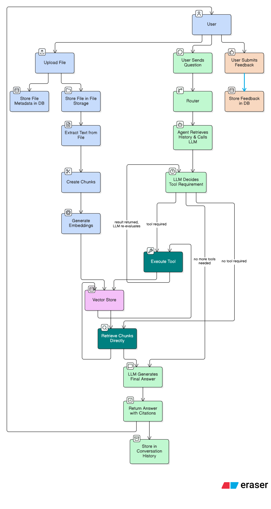

## Table of Contents

- [Overview](#overview)
- [Architecture](#architecture)
  - [1. Upload Flow](#1-upload-flow)
  - [2. Chat Flow](#2-chat-flow)
  - [3. Feedback Flow](#3-feedback-flow)
- [Diagram](#diagram)

## Overview

The system is built around three core flows:

1. **Upload** – processing and storing uploaded documents for retrieval.
2. **Chat** – routing user questions to the appropriate agent, retrieving relevant chunks, and generating an answer using an LLM.
3. **Feedback** – storing user feedback for future analysis and improvement.

## Architecture

### 1. Upload Flow

1. User uploads a file.
2. File metadata is stored in the database.
3. The file is stored in file storage.
4. Text is extracted from the file.
5. Extracted text is divided into structure-aware chunks.
6. Chunks are embedded and stored in the vector store.

### 2. Chat Flow

1. User sends a question.
2. The question is passed to the router.
3. The router forwards the question to the appropriate agent.
4. The agent retrieves the conversation history.
5. The LLM decides whether a tool is required.
6. If a tool is required:
   - The agent calls the appropriate tool.
   - `search_document` retrieves relevant chunks from the vector store.
   - The retrieved chunks are passed back to the LLM.
   - The LLM generates the final answer.
7. If no tool is required:
   - The agent uses the normal RAG flow through `answer_query`.
   - Relevant information is retrieved.
   - The LLM generates the answer.
8. The answer is returned to the user.
9. The conversation is stored in chat history.

### 3. Feedback Flow

1. User submits feedback on the generated answer.
2. Feedback is stored in the database.
3. The feedback can be used for future analysis and improvement.

### 4. Diagram

